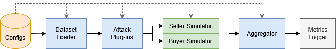

# This repository provides the official implementation of our code:  



---

## 🔧 Requirements

To build the environment:

```bash
bash env_build.sh
```


## ⚙️ Config Generation

To generate the configurations for experiments:
```bash
python entry/gradient_market/automate_exp/config_generation.py
```

This code would generate all the configuration, you can go to the files to tune the generated configs.


## config generation
To run the attack we need first generate configuration that setup everything:

```bash
python entry/gradient_market/automate_exp/config_generation.py 
```

This script generates all necessary configuration files. You can edit them manually afterward in the **`<./configs>`** directory.

## 🚀 Run a Single Attack

To launch a specific attack using a configuration:
```bash
python entry/gradient_market/attack_new.py <config_path>
```

### Arguments:
- **`<config_path>`**: Path to a specific YAML config file.

## 🧪 Run Multiple Attacks in Batch

```bash
python entry/gradient_market/automate_exp/auto_run.py --config-dir <config_dir> --parallel [parallel]
```
### Arguments:
- **`<config_dir>`**: Root directory containing all YAML config files.
- **`[parallel]`** *(Optional)*: Number of processes to run in parallel (default: 20).


## 📊 Result Preprocessing
To convert raw logs into CSV format for analysis:
```bash
python result_analysis/process_log_new.py --result_path [result_path]  --output_dir [output_dir]
```
### Arguments:
- **`[result_path]`** *(Optional)*: Path to root experiment logs (default: **`./experiment_result`**).
- **`[parallel]`** *(Optional)*: Where to save processed results (default: **`./results`**).


## 📈 Visualization

Use the [visual_results_final.ipynb](visual_results_final.ipynb) notebook to reproduce the main paper figures.


## License

This project is licensed under the [MIT License](LICENSE).